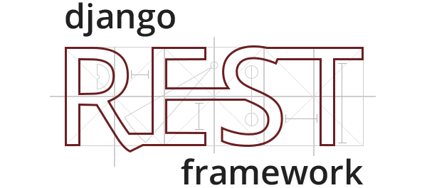

<h1 align='center'> API de Catálogo de Livros </h1>

<p align='center'>Esta é uma API de catálogo de livros desenvolvida com Django Rest Framework, foi projetada para armazenar informações sobre livros, incluindo nome do livro, nome do autor, ano de lançamento e número da edição.</p>

<a align='center' href="https://www.djangoproject.com/" target="_blank">
    
</a>

<a align='center' href="https://www.django-rest-framework.org/" target="_blank">
    
</a>

<a align='center' ref="https://www.python.org/" target="_blank">
    
</a>

## 🔧 Ferramentas

-   Python: é uma linguagem de programação de alto nível, interpretada, orientada a objetos e de propósito geral.
-   Django: framework de desenvolvimento web de código aberto, escrito em Python, que oferece uma estrutura robusta e eficiente para a criação de aplicativos web.
-   Django Rest Framework: é uma poderosa biblioteca de terceiros para o Django, um framework de desenvolvimento web em Python. O DRF estende a funcionalidade do Django para facilitar a criação de APIs (Application Programming Interfaces) RESTful de maneira eficiente e consistente.

## 📍 Endpoints

- `GET /livro/`: Retorna a lista de todos os livros no catálogo.
- `POST /livro/`: Cria um novo livro no catálogo.
- `GET /livro/{id}/`: Retorna os detalhes de um livro específico com base no ID.
- `PUT /livro/{id}/`: Atualiza as informações de um livro específico com base no ID.
- `DELETE /livro/{id}/`: Exclui um livro específico com base no ID.

## 📄 Modelos de Dados

- `Livro`:
  - `id` (campo automático): O identificador único do livro.
  - `nome` (string): Nome do livro.
  - `nomeDoAutor` (string): Nome do autor do livro.
  - `anoDeLancamento` (inteiro): Ano de lançamento do livro.
  - `numEdicao` (inteiro): Número da edição do livro.

## ⚙️ Uso da API

A API pode ser usada para:

- Listar todos os livros no catálogo.
- Adicionar um novo livro ao catálogo.
- Recuperar detalhes de um livro específico com base no ID.
- Atualizar informações de um livro existente.
- Excluir um livro específico do catálogo.

## 💻 Como Executar o Projeto

Siga estas etapas para configurar e executar a API em seu ambiente:

1. Clone este repositório:

  ```shell
  git clone https://seurepositorio.git
  ```
2. Navegue até o diretório do projeto:

  ```shell
  cd nomedoprojeto/
  ```
3. Crie e ative um ambiente virtual:

  ```shell
  python -m venv venv
  source venv/bin/activate  # No Windows, use 'venv\Scripts\activate'
  ```
4. Instale as dependências:

  ```shell
  pip install -r requirements.txt
  ```
5. Execute as migrações do banco de dados:

  ```shell
  python manage.py migrate
  ```
6. Inicie o servidor de desenvolvimento:

  ```shell
  python manage.py runserver
  ```

A API estará acessível em http://localhost:8000/.

## 🌐 Exemplo de Solicitação

### Criar um Novo Livro

      Método: POST
      URL: http://localhost:8000/livro/

### Corpo da Solicitação:

```json
{
  "nome": "Nome do Livro",
  "nomeDoAutor": "Nome do Autor",
  "anoDeLancamento": 2023,
  "numEdicao": 1
}
```

## 🙏 Contribuição:

Contribuições são bem-vindas! Sinta-se à vontade para enviar problemas, solicitações de pull e feedback.